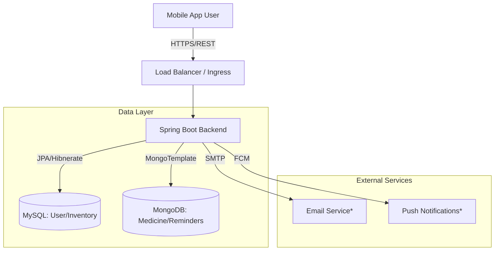

# Mediscan: System Architecture

## Overview
Mediscan is a Smart Medicine Management and Reminder System designed to help users track their medication inventory, schedule reminders, and manage prescriptions. The system is built as a full-stack application with a Spring Boot backend and a React Native frontend.

## Architecture Diagram

## detailed Components

### 1. Frontend (Mobile App)
- **Technology**: React Native with TypeScript.
- **Navigation**: React Navigation (Bottom Tabs + Stacks).
- **State Management**: React Context (AuthContext) + Local State.
- **Key Modules**:
    - **Auth**: Login, Register.
    - **Dashboard**: Quick view of reminders and inventory.
    - **Inventory**: Track stock levels, low-stock alerts.
    - **Reminders**: Schedule and acknowledge medication intake.
    - **Scan**: Barcode scanning (Mock/Camera) for quick entry.

### 2. Backend (API Server)
- **Technology**: Spring Boot 3.x (Java 17).
- **Security**: Spring Security + JWT (Stateless).
- **Build Tool**: Maven.
- **Key Modules**:
    - `com.mediscan.user`: User management and authentication.
    - `com.mediscan.medicine`: MongoDB-based medicine catalog.
    - `com.mediscan.inventory`: MySQL-based stock tracking.
    - `com.mediscan.reminder`: Scheduling logic.

### 3. Database Layer (Hybrid)
- **MySQL**: Relational data tailored for structured records like Users and Inventory counts where transaction integrity is critical.
- **MongoDB**: Flexible document storage for Medicine catalog (varying attributes) and Audit Logs (high volume).

## Deployment (Docker)
The system is containerized using Docker Compose:
- **mediscan_backend**: The Spring Boot API.
- **mediscan_mysql**: MySQL 8.0 instance.
- **mediscan_mongo**: MongoDB 6.0 instance.

## Security
- **Authentication**: JWT Bearer tokens.
- **Password Hashing**: BCrypt.
- **Role-Based Access**: Role (USER/ADMIN) checks on endpoints.

_* Planned future integrations_
